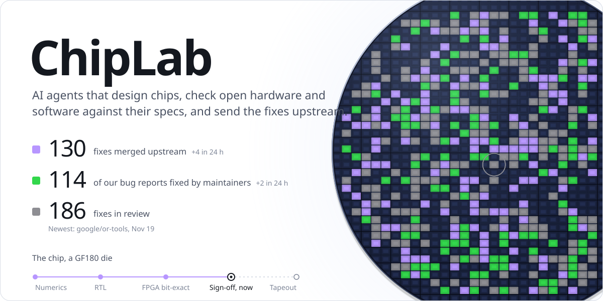

<picture><source media="(max-width: 600px) and (prefers-color-scheme: dark)" srcset="assets/poster-tall-dark.svg"><source media="(max-width: 600px)" srcset="assets/poster-tall-light.svg"><source media="(prefers-color-scheme: dark)" srcset="assets/poster-dark.svg"></picture>

### Recently merged

| Project | Fix | Merged |
|:---|:---|:---|
| [locationtech/jts](https://github.com/locationtech/jts/pull/1245) | Fix IsSimpleOp for empty MultiPoint elements | Nov 19 |
| [qiboteam/qibo](https://github.com/qiboteam/qibo/pull/2020) | Fix grouping in QASM gate parameters | Nov 17 |
| [formulajs/formulajs](https://github.com/formulajs/formulajs/pull/254) | Fix NPV handling of non-numeric values | Nov 17 |
| [spglib/spglib](https://github.com/spglib/spglib/pull/642) | fix: correct Cartesian standardization of magnetic datasets | Nov 17 |
| [enjoy-digital/litejesd204](https://github.com/enjoy-digital/litejesd204/pull/11) | transport: fix conversion data placement with tail bits | Nov 17 |
| [obgm/libcoap](https://github.com/obgm/libcoap/pull/2193) | coap_debug.c: Use bounded appends in coap_show_pdu | Nov 16 |
| [microsoft/DirectXMath](https://github.com/microsoft/DirectXMath/pull/357) | Fix rounding in SSE byte stores | Nov 16 |
| [Kotlin/kotlinx-datetime](https://github.com/Kotlin/kotlinx-datetime/pull/664) | Fix escaping in formatAsKotlinBuilderDsl | Nov 16 |
| [kfrlib/kfr](https://github.com/kfrlib/kfr/pull/284) | Preserve imaginary output in complex convolution and correlation | Nov 14 |
| [kfrlib/kfr](https://github.com/kfrlib/kfr/pull/283) | Fix DCT scratch buffer overlap | Nov 14 |

All 127 merged fixes, across 116 projects: [abseil-cpp](https://github.com/abseil/abseil-cpp), [openexr](https://github.com/AcademySoftwareFoundation/openexr), [MNN](https://github.com/alibaba/MNN), [arrow-nanoarrow](https://github.com/apache/arrow-nanoarrow), [sedona](https://github.com/apache/sedona), [astc-encoder](https://github.com/ARM-software/astc-encoder), [CMSIS-NN](https://github.com/ARM-software/CMSIS-NN), [c-blosc2](https://github.com/Blosc/c-blosc2), [histogram](https://github.com/boostorg/histogram), [url](https://github.com/boostorg/url), [gtsam](https://github.com/borglab/gtsam), [protobuf-es](https://github.com/bufbuild/protobuf-es), [casadi](https://github.com/casadi/casadi), [cdk](https://github.com/cdk/cdk), [ceres-solver](https://github.com/ceres-solver/ceres-solver), [cesium](https://github.com/CesiumGS/cesium), [libyang](https://github.com/CESNET/libyang), [sv-tests](https://github.com/chipsalliance/sv-tests), [cmark](https://github.com/commonmark/cmark), [cvxpy](https://github.com/cvxpy/cvxpy), [culori](https://github.com/danburzo/culori), [xgboost](https://github.com/dmlc/xgboost), [litejesd204](https://github.com/enjoy-digital/litejesd204), [litesata](https://github.com/enjoy-digital/litesata), [jackson-core](https://github.com/FasterXML/jackson-core), [basix](https://github.com/FEniCS/basix), [finufft](https://github.com/flatironinstitute/finufft), [flint](https://github.com/flintlib/flint), [fmt](https://github.com/fmtlib/fmt), [fontkit](https://github.com/foliojs/fontkit), [fonttools](https://github.com/fonttools/fonttools), [formatjs](https://github.com/formatjs/formatjs), [formulajs](https://github.com/formulajs/formulajs), [fribidi](https://github.com/fribidi/fribidi), [temporal-polyfill](https://github.com/fullcalendar/temporal-polyfill), [gem5](https://github.com/gem5/gem5), [ghdl](https://github.com/ghdl/ghdl), [ginkgo](https://github.com/ginkgo-project/ginkgo), [graphology](https://github.com/graphology/graphology), [hdl-modules](https://github.com/hdl-modules/hdl-modules), [gdstk](https://github.com/heitzmann/gdstk), [libconfig](https://github.com/hyperrealm/libconfig), [ical4j](https://github.com/ical4j/ical4j), [highdicom](https://github.com/ImagingDataCommons/highdicom), [ispc](https://github.com/ispc/ispc), [jgrapht](https://github.com/jgrapht/jgrapht), [FastTransforms.jl](https://github.com/JuliaApproximation/FastTransforms.jl), [DSP.jl](https://github.com/JuliaDSP/DSP.jl), [Colors.jl](https://github.com/JuliaGraphics/Colors.jl), [keras](https://github.com/keras-team/keras), [kfr](https://github.com/kfrlib/kfr), [KTX-Software](https://github.com/KhronosGroup/KTX-Software), [KTX-Software-CTS](https://github.com/KhronosGroup/KTX-Software-CTS), [kotlinx-datetime](https://github.com/Kotlin/kotlinx-datetime), [lance](https://github.com/lance-format/lance), [cdflib](https://github.com/lasp/cdflib), [libexif](https://github.com/libexif/libexif), [libical](https://github.com/libical/libical), [libxsmm](https://github.com/libxsmm/libxsmm), [DREAMPlace](https://github.com/limbo018/DREAMPlace), [circt](https://github.com/llvm/circt), [jts](https://github.com/locationtech/jts), [mockturtle](https://github.com/lsils/mockturtle), [mfem](https://github.com/mfem/mfem), [DirectXMath](https://github.com/microsoft/DirectXMath), [matrix](https://github.com/mljs/matrix), [msgpack-c](https://github.com/msgpack/msgpack-c), [cfdm](https://github.com/NCAS-CMS/cfdm), [networkit](https://github.com/networkit/networkit), [nickel](https://github.com/nickel-lang/nickel), [nibabel](https://github.com/nipy/nibabel), [nodatime](https://github.com/nodatime/nodatime), [hifitime](https://github.com/nyx-space/hifitime), [libcoap](https://github.com/obgm/libcoap), [optimizer](https://github.com/onnx/optimizer), [arpack-ng](https://github.com/opencollab/arpack-ng), [core-v-mcu](https://github.com/openhwfoundation/core-v-mcu), [cv-hpdcache](https://github.com/openhwfoundation/cv-hpdcache), [OpenMDAO](https://github.com/OpenMDAO/OpenMDAO), [stablehlo](https://github.com/openxla/stablehlo), [ojAlgo](https://github.com/optimatika/ojAlgo), [ParmEd](https://github.com/ParmEd/ParmEd), [pycaption](https://github.com/pbs/pycaption), [piqp](https://github.com/PREDICT-EPFL/piqp), [Pillow](https://github.com/python-pillow/Pillow), [qibo](https://github.com/qiboteam/qibo), [radare2](https://github.com/radareorg/radare2), [spatialmath-python](https://github.com/rai-opensource/spatialmath-python), [riscv-tests](https://github.com/riscv-software-src/riscv-tests), [riscv-opcodes](https://github.com/riscv/riscv-opcodes), [ron](https://github.com/ron-rs/ron), [SALib](https://github.com/SALib/SALib), [seacas](https://github.com/sandialabs/seacas), [pyvcd](https://github.com/SanDisk-Open-Source/pyvcd), [awkward](https://github.com/scikit-hep/awkward), [scikit-rf](https://github.com/scikit-rf/scikit-rf), [OrdinaryDiffEq.jl](https://github.com/SciML/OrdinaryDiffEq.jl), [json](https://github.com/serde-rs/json), [tract](https://github.com/sonos/tract), [spglib](https://github.com/spglib/spglib), [universal](https://github.com/stillwater-sc/universal), [taglib](https://github.com/taglib/taglib), [tskit](https://github.com/tskit-dev/tskit), [unicode-segmentation](https://github.com/unicode-rs/unicode-segmentation), [cftime](https://github.com/Unidata/cftime), [darts](https://github.com/unit8co/darts), [mitiq](https://github.com/unitaryfoundation/mitiq), [UVVM](https://github.com/UVVM/UVVM), [verilator](https://github.com/verilator/verilator), [veryl](https://github.com/veryl-lang/veryl), [rust_hdl](https://github.com/VHDL-LS/rust_hdl), [vortex](https://github.com/vortexgpgpu/vortex), [libucl](https://github.com/vstakhov/libucl), [wabt](https://github.com/WebAssembly/wabt), [umi](https://github.com/zeroasiccorp/umi), [minizip-ng](https://github.com/zlib-ng/minizip-ng).

Early credits

| Project | Found |
|:---|:---|
| [LiteDRAM](https://github.com/enjoy-digital/litedram/pull/415) | AXI write responses lost under BREADY backpressure |
| [LiteDRAM](https://github.com/enjoy-digital/litedram/pull/416) | DMA AXI byte addressing and WLAST |
| [LiteEth](https://github.com/enjoy-digital/liteeth/pull/281) | ARP cache returning the wrong MAC address |
| [LitePCIe](https://github.com/enjoy-digital/litepcie/pull/193) | MSI-X upper address and masked interrupts |
| [Highway](https://github.com/google/highway/pull/3475) | f64 to f32 demotion overflowing on finite values |

Updated 2026-11-19 from public GitHub records. ChipLab is a Donmakino LLC lab: [chiplab.donmakino.com](https://chiplab.donmakino.com)
